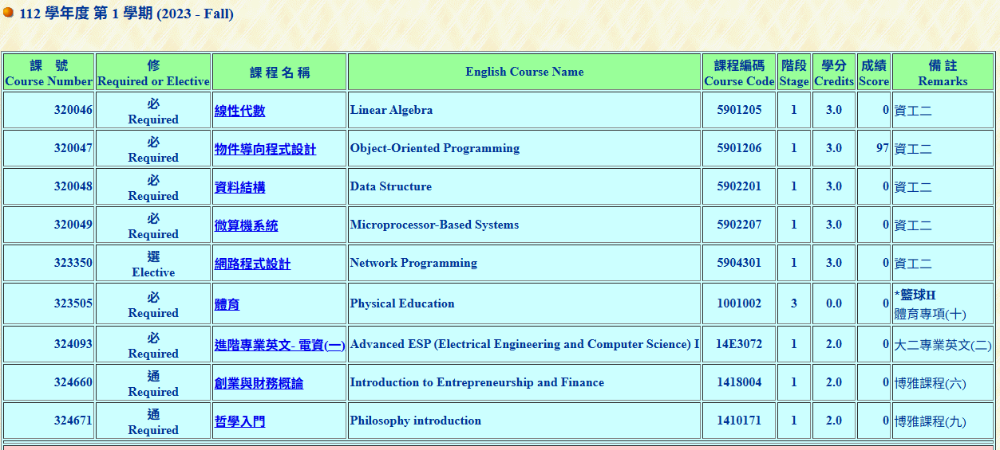

# Abstract

遊戲名稱：冰火姊弟

組員：

- 112820037 葉又仁

# Game Introduction

冰火姊弟是一款雙人合作解謎平台遊戲，玩家分別操作火男孩與水女孩，在充滿機關與陷阱的關卡中互相配合前進。火男孩能通過火焰與熔岩，水女孩則能穿越水池，兩人必須避開對方無法通過的元素。玩家需要利用按鈕、電梯與機關解開謎題，同時收集寶石並順利抵達出口，是一款強調合作與思考的冒險遊戲。

# Development timeline

- Week 2：準備工作與素材找尋
  - [ ] 撰寫 Proposal 
- Week 3：背景構建與人物素材
  - [ ] 關卡機關與背景設定
  - [ ] 讓角色可以在畫面顯示並左右移動
- Week 4：關卡機制
  - [ ] 實作走路和跳躍動畫
  - [ ] 處理角色與機關的互動邏輯
- Week 5：關卡機制
  - [ ] 實作按鈕，電梯，傳送門
  - [ ] 角色死亡條件
- Week 6：關卡機制
  - [ ] 實作按鈕，電梯，傳送門
  - [ ] 角色死亡條件
- Week 7：期中整合與初步優化
  - [ ] 整合目前的關卡流程，修正明顯錯誤
- Week 8：期中緩衝週
  - [ ] 補強進度或構思更多關卡互動
- Week 9：測試更多操作機制
  - [ ] 帶條件的二段跳
  - [ ] 能夠發射對應元素
- Week 10：UI 介面與血條
  - [ ] 製作關卡篇章，機制教學，結算畫面
  - [ ] 角色血條與寶石放置
- Week 11：機制疊加與UI 介面
  - [ ] 繼續優化UI邏輯
  - [ ] 設計更複雜的關卡
- Week 12：關卡完善
  - [ ] 實際操作關卡邏輯，避免無法通關
  - [ ] 加入更多死亡條件
- Week 13：音效整合與初步測試
  - [ ] 加入背景音樂與戰鬥音效，進行初步試玩
- Week 14：Debug 與測試
  - [ ] 專心修復遊戲崩潰 or 邏輯錯誤
- Week 15：Debug 與測試
  - [ ] 繼續修復
- Week 16：最後檢查
  - [ ] 做各種檢查
- Week 17：交件準備
  - [ ] 錄製示範影片、製作簡報與文件

# OOP 修課證明 (if you need)

