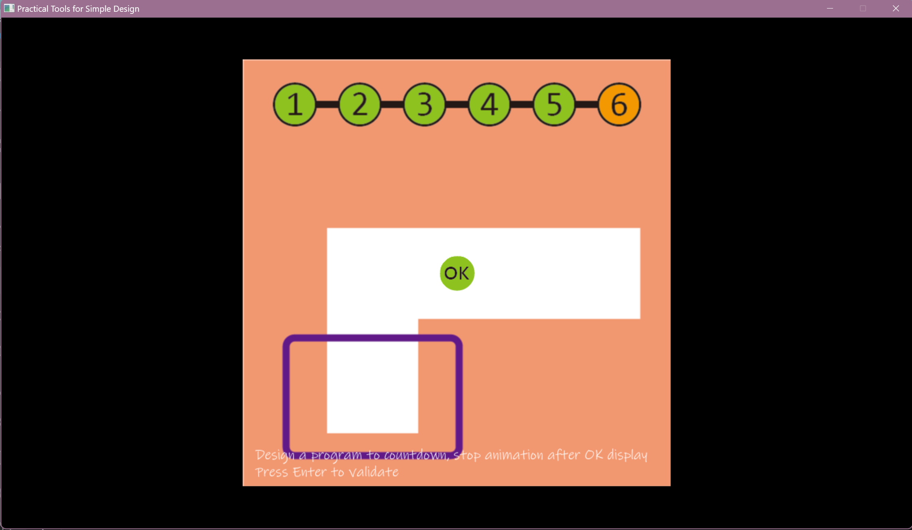
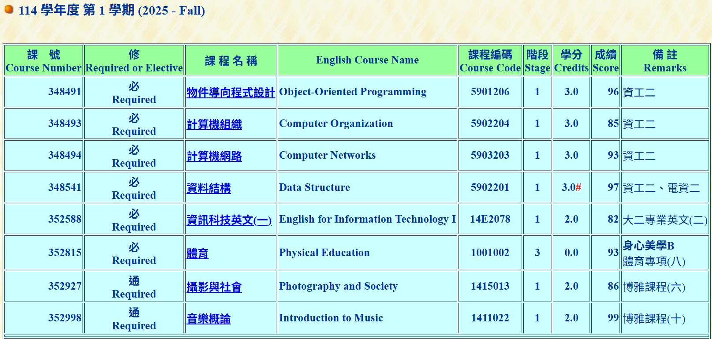

# Abstract

遊戲名稱：PICO PARK: Classic Edition

組員：

- 113590002 陳書璿

# Game Introduction

《PICO PARK: Classic Edition》是一款風靡的 2D 合作解謎動作遊戲（Steam 可免費下載）
主打「團隊合作」與「歡樂友情破壞」。遊戲支援 2 至 10 人在本地或線上連線遊玩，
玩家需扮演彩色方塊貓，透過靈活配合來解開 20 個經典關卡。

# Development timeline

- Week 1：準備素材 + PTSD API 熟悉
  - [ ] 蒐集遊戲的素材
  - [ ] 從長頸鹿訓練內容拓展學習內容
- Week 2：處理遊戲的封面選單素材與起始設定
  - [ ] 處理遊戲封面的素材
  - [ ] 將遊戲起始設定調好(人數、按鍵綁定設定等等)
- Week 3：建立物件
  - [ ] 設定完成玩家物件
  - [ ] 設定好不可動且無變化環境物件
  - [ ] 完成角色與環境互動
- Week 4：建立物件
  - [ ] 設定好不可動且有變化環境物件
  - [ ] 完成角色與部分可動環境物件互動
- Week 5：建立物件
  - [ ] 設定好部分可動環境物件
  - [ ] 完成角色與部分可動環境物件互動
- Week 6：建立物件
  - [ ] 設定好部分可動環境物件
  - [ ] 完成角色與所有可動環境物件互動
- Week 7：建立物件
  - [ ] 完成不可動環境物件與可動環境物件互動
- Week 8：計時設定與角色復活機制設定
  - [ ] 關卡內遊戲時長計時設定
  - [ ] 角色死亡及(存檔點)復活機制設定
- Week 9： 關卡設計
  - [ ] 第一關遊戲玩法與通關條件
  - [ ] 第二關遊戲玩法與通關條件
  - [ ] 第三關遊戲玩法與通關條件
- Week 10： 關卡設計
  - [ ] 第四關遊戲玩法與通關條件
  - [ ] 第五關遊戲玩法與通關條件
  - [ ] 第六關遊戲玩法與通關條件
- Week 11： 關卡設計
  - [ ] 第七關遊戲玩法與通關條件
  - [ ] 第八關遊戲玩法與通關條件
  - [ ] 第九關遊戲玩法與通關條件
- Week 12： 關卡設計
  - [ ] 第十關遊戲玩法與通關條件
  - [ ] 第十一關遊戲玩法與通關條件
  - [ ] 第十二關遊戲玩法與通關條件
- Week 13： 關卡設計
  - [ ] 第十三關遊戲玩法與通關條件
  - [ ] 第十四關遊戲玩法與通關條件
  - [ ] 第十五關遊戲玩法與通關條件
- Week 14： debug 與優化
  - [ ] 測試前面關卡以及除錯
  - [ ] 優化遊戲
- Week 15： debug 與優化
  - [ ] 測試前面關卡以及除錯
  - [ ] 優化遊戲
- Week 16： debug 與優化
  - [ ] 測試前面關卡以及除錯
  - [ ] 優化遊戲
- Week 17： 期末報告
  - [ ] 保重

# OOP 修課證明

